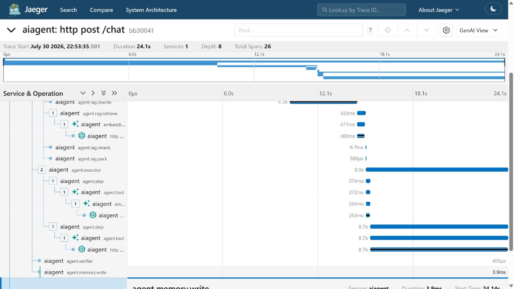
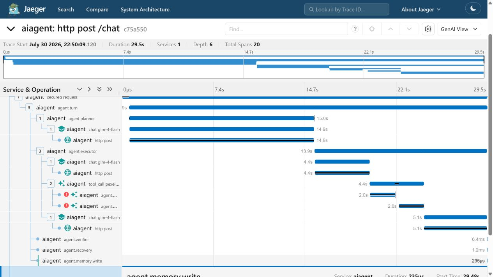
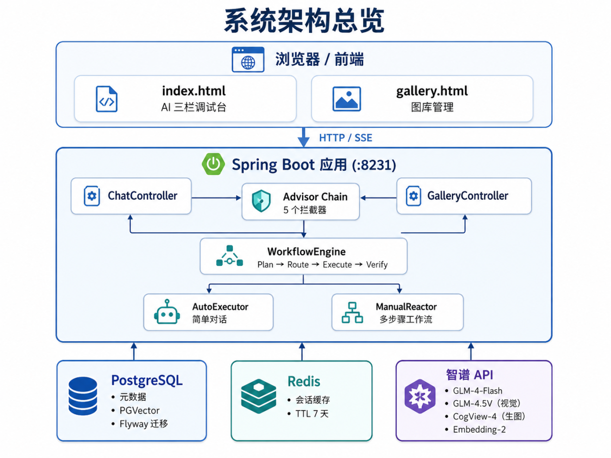
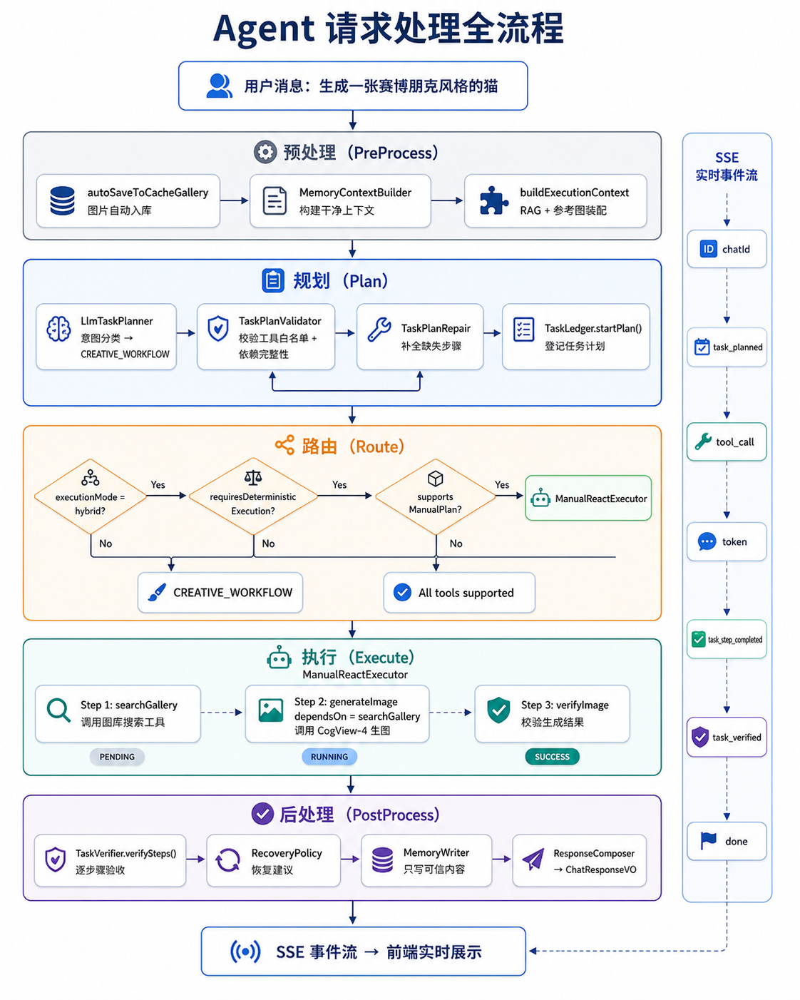
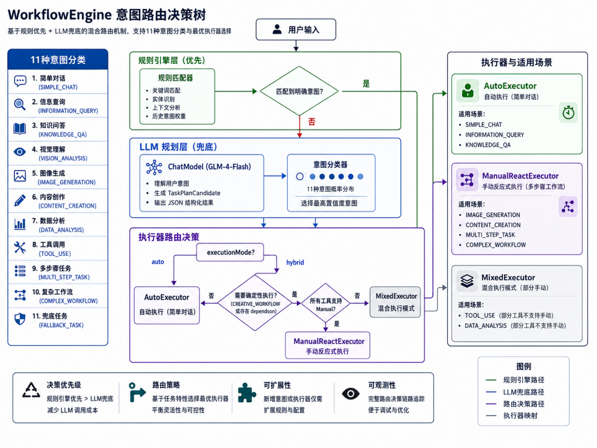
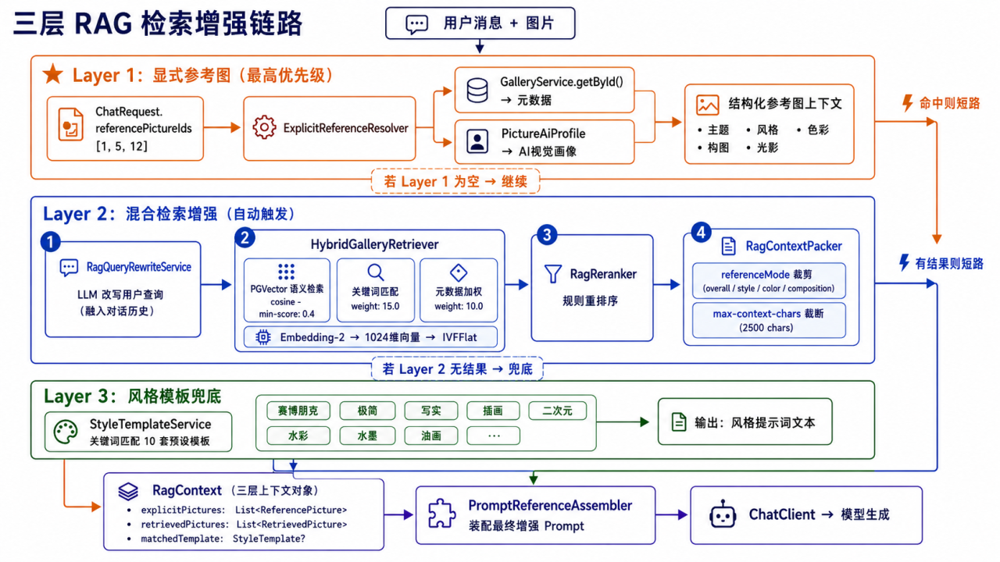

# 云图库 AI Agent

<p align="center">
  
  
  
  
  
  
  
  <a href="https://github.com/moonbirds23/ai-agent/actions"></a>
</p>

**基于 Spring AI 的多模态 AI Agent，实现对话式图片生成、图库管理与检索增强。** 全链路接入智谱 GLM 大模型（GLM-4-Flash / GLM-4.5V / CogView-4 / Embedding-2），支持流式 SSE 响应、LLM 驱动的任务规划与 WorkflowEngine 工作流引擎、三层 RAG 检索增强、MCP 工具协议、PGVector 语义检索及 RAG 评测体系。

## 真实 Agent Trace 案例

本项目提供三条经过本地真实运行验证的 Trace：

| 案例 | 证明什么 | 实测结果 |
|---|---|---|
| **RAG 雪景生图** | 检索结果真实进入生成工具并通过后端验收 | 39 候选 → 5 参考 → 1 张图片 |
| **MCP 超时失败** | 有限重试、禁止虚假成功、失败结果不写记忆 | 2 次超时 → 验收失败 → Memory=false |
| MCP 跨进程搜索 | Tool Call → MCP Server → Pexels，使用 Span Link 表达跨 Trace 因果关系 | 3 个真实候选，详情页高级案例 |

[查看完整 Trace、公开提示词、Span 属性、性能拆分与自动断言脚本](docs/observability/agent-tracing.md)

**成功链路：RAG 命中后生图**



**失败链路：MCP 超时后拒绝伪造结果**



> MCP SSE 在当前 Spring AI 1.0.0 / MCP SDK 0.10.0 下不能可靠逐调用传播
> W3C Trace Context。项目使用真实 Span Link 表达跨 Trace 因果关系，并记录
> `agent.mcp.trace_context_propagated=false`，没有用业务 ID 冒充父子链。

---

## 架构全景



> 四层架构：浏览器调试台 → Spring Boot 应用层 → 数据/缓存中间件 → 外部 AI 服务

### Agent 请求处理全流程



> 一个用户请求经过的 5 个阶段：预处理 → WorkflowEngine 规划 → 执行器路由 → 步骤执行 → 验收与响应

### WorkflowEngine 意图路由



> 11 种意图分类 + 执行器选择策略：规则引擎优先，LLM 规划兜底

### RAG 检索增强链路



> 三层渐进式检索：显式参考图（优先）→ 混合检索增强（自动）→ 风格模板（兜底）

---

## 功能矩阵

### Agent 任务引擎

| 能力 | 实现 | 代码位置 |
|------|------|----------|
| **意图分类** | 11 种 TaskType 规则引擎 + LLM 规划兜底 | `TaskPlanner.java` → `LlmTaskPlanner.java` |
| **执行器路由** | Hybrid 模式：Auto（Spring AI Tool Calling）/ Manual（步骤顺序执行） | `AgentExecutorRouter.java` |
| **步骤依赖执行** | ManualReactExecutor 按 dependsOn 顺序执行，失败自动阻断 | `ManualReactExecutor.java` |
| **任务验收** | TaskVerifier 按计划逐步骤验收 + RecoveryPolicy 恢复建议 | `TaskVerifier.java` · `RecoveryPolicy.java` |
| **WorkflowEngine** | 统一编排 Plan → Route → Execute → Verify | `WorkflowEngine.java` |

### RAG 检索增强（三层）

| 层次 | 机制 | 技术实现 |
|------|------|----------|
| **Layer 1** | 用户显式选择参考图（≤3 张） | `ExplicitReferenceResolver` — 图库元数据 + AI 画像 |
| **Layer 2** | 自动混合检索 | Query 改写 → PGVector 语义检索 + 关键词匹配 + 元数据加权 → 重排序 → 上下文压缩 |
| **Layer 3** | 风格模板兜底 | 10 套预设模板关键词自动匹配 |

### RAG 评测体系

基于 10 条人工标注 Query（0~3 分级相关性）的检索质量评价框架。

| 能力 | 说明 |
|------|------|
| **数据集** | 102 张图片 corpus manifest + cases.jsonl（含 relevantPictures / mustNotReturn / expectedEmpty） |
| **标注方法** | 候选池法——合并向量检索 + 关键词检索结果，人工逐张标注 3（高度相关）/2（相关）/1（弱相关）/0（不相关） |
| **指标** | HitRate@5 / Recall@5 / Precision@5 / MRR@5 / nDCG@5 / CandidateRecall@20 / RerankGain / RelevantDropRate / EmptyResultAccuracy / ForbiddenResultRate |
| **运行模式** | fixed-retrieval（跳过 LLM 改写，消除随机性）/ rewrite-only / end-to-end |
| **回归门禁** | HitRate@5 不降超 1 个 case / Recall@5 不降超 0.02 / nDCG@5 不降超 0.02 / RelevantDropRate 不升高 |
| **当前 baseline** | HitRate@5=0.78, Recall@5=0.19, MRR@5=0.67, nDCG@5=0.42, EmptyAcc=1.00 |

```bash
# 运行评测
JAVA_HOME="D:/develop/java/JDK/jdk-21" mvn -Dtest=RagEvaluationIT -Drag.eval.enabled=true test
```

### MCP 工具协议

将 Pexels 图片搜索和图库候选召回能力抽为独立 MCP Server，主应用作为 MCP Client 通过 Gateway 消费。

```
IMAGE_RETRIEVAL_MODE=local → PexelsSearchTools → PexelsPhotoService → Pexels API
IMAGE_RETRIEVAL_MODE=mcp   → PexelsSearchTools → ImageRetrievalGateway
                               → McpToolInvoker → McpSyncClient
                                 → MCP Server (:8232) → Pexels API
```

| 组件 | 位置 | 职责 |
|------|------|------|
| **MCP Server** | `mcp-servers/image-retrieval-server/` | 独立 Spring Boot 进程，暴露 Pexels 搜索/精选/详情 3 个 `@Tool` |
| **McpToolInvoker** | `integration/mcp/` | 封装 McpSyncClient.callTool()，错误转 BusinessException |
| **ImageRetrievalGateway** | `integration/mcp/` | 接口 + local/mcp 双实现，`@ConditionalOnProperty` 切换 |
| **Resilience4j** | `application.yml` | 熔断 + 重试保护 MCP 调用链路 |
| **协议测试** | 22 个测试 | 假 HTTP Server 模拟 Pexels，不依赖真实 API |

```bash
# 启动 MCP Server
mvn -f mcp-servers/image-retrieval-server/pom.xml spring-boot:run

# 主应用切 MCP 模式
IMAGE_RETRIEVAL_MODE=mcp mvn spring-boot:run -Dspring-boot.run.profiles=local
```

### 对话记忆管理

```
会话请求 ──► Redis (热数据，TTL 7天) ──► PostgreSQL (冷持久化)
                  │                              │
                  │ LRANGE 负索引截断              │ Flyway V3 chat_message 表
                  │ 最多 200 条/会话               │ conversation_id 索引
                  ▼                              ▼
              快速对话恢复                     完整历史审计
```

### 图库管理

- **存储**：PostgreSQL（元数据） + 本地文件系统 / COS（图片文件）
- **向量**：PGVector，Embedding-2 模型，1024 维，IVFFlat 索引
- **AI 画像**：GLM-4.5V 视觉模型分析 → `PictureAiProfile`（主题/风格/色彩/构图/光影/氛围）
- **去重**：SHA-256 哈希（上传/导入前自动检查）
- **缓存图库**：对话图片自动以 CACHE 位置入库，定时清理

### 流式 SSE 事件

| 事件类型 | 说明 |
|----------|------|
| `chatId` | 首条事件，携带会话 ID |
| `task_planned` | TaskPlan 创建，包含步骤列表和执行器选择 |
| `token` | 逐字推送模型输出 |
| `tool_call` | 工具调用名称 + 参数摘要 |
| `task_step_started/completed/failed` | 步骤级生命周期 |
| `progress` | 进度信息 |
| `image_generated` | 生图结果 + 下载/保存按钮 |
| `task_verified` | 验收结果 + Recovery 建议 |
| `done` | 最终结构化 ChatResponseVO |
| `error` | 错误信息（区分 BusinessException 和未知异常） |

### 安全

- **SSRF 防护**：`UrlSecurityValidator` 校验内网地址
- **内容安全**：`ContentGuardAdvisor` 关键词 + 格式校验
- **API Key 认证**：`ApiKeyAuthFilter` + Spring Security（`@Profile("!test")`）
- **速率限制**：`RedisRateLimiter` — Lua 脚本滑动窗口，分布式部署共享计数
- **XSS 防护**：前端 `escHtml()` / `escAttr()` / `jsString()` 三层转义

### 生产就绪

- **健康探针**：Spring Boot Actuator + liveness/readiness probes
- **优雅关闭**：`server.shutdown: graceful` + 30s 等待 SSE 完成
- **日志**：logback 控制台 + 文件滚动（30 天/3GB）
- **CI**：GitHub Actions `mvn test` on push/PR
- **容器化**：多阶段 Dockerfile（Maven 构建 → JRE 运行）+ docker-compose（PG + Redis + App 编排）
- **熔断降级**：Resilience4j CircuitBreaker + Retry（智谱 3 实例）

---

## 快速启动

### 前置条件

- Docker Desktop 或 Docker Engine
- 智谱 API Key（[申请地址](https://open.bigmodel.cn/)）

### 一键启动

```bash
git clone https://github.com/moonbirds23/ai-agent.git
cd ai-agent

# 设置 API Key（必填，否则 AI 调用会失败）
export ZHIPU_API_KEY=你的智谱API密钥
export APP_API_KEY=自定义访问密码    # 前端访问需要

# 一条命令：编译打包 + 启动 PostgreSQL + Redis + App
docker compose up -d

# 等待约 30 秒（首次需下载依赖），确认启动成功
curl http://localhost:8231/api/health
# → {"code":0,"data":"ok","message":"ok"}
```

打开浏览器访问：
- **AI 助手对话台**：`http://localhost:8231`
- **图库管理台**：`http://localhost:8231/gallery.html`
- **Swagger API 文档**：`http://localhost:8231/api/doc.html`

### 本地开发

```bash
# Windows（系统 JDK 1.8 需指定 JAVA_HOME）
JAVA_HOME="D:/develop/java/JDK/jdk-21" mvn spring-boot:run -Dspring-boot.run.profiles=local

# 运行测试
JAVA_HOME="D:/develop/java/JDK/jdk-21" mvn test
```

---

## 技术栈

| 类别 | 技术 | 版本 | 用途 |
|------|------|------|------|
| **语言** | Java | 21 (--enable-preview) | 核心开发语言 |
| **框架** | Spring Boot | 3.5.14 | 应用框架 |
| **AI** | Spring AI | 1.0.0 GA | ChatClient · Advisor · Tool Calling · VectorStore |
| **大模型** | 智谱 GLM | GLM-4-Flash / 4.5V / CogView-4 / Embedding-2 | 文本对话 · 视觉分析 · 图片生成 · 向量嵌入 |
| **数据库** | PostgreSQL 16 | pgvector 扩展 | 元数据存储 + 向量检索 |
| **缓存** | Redis 7 | Lettuce + Commons Pool2 | 会话记忆 · 限流 · 缓存 |
| **迁移** | Flyway | — | 数据库版本管理（7 个迁移脚本） |
| **容错** | Resilience4j | 2.3.0 | 熔断 + 重试（智谱 API） |
| **协议** | MCP | 1.0.0 | 独立 MCP Server + Client Gateway + 假 HTTP 测试 |
| **文档** | SpringDoc OpenAPI | 2.8.13 | API 文档 / Swagger UI |
| **容器** | Docker + Compose | — | 容器化部署编排 |
| **CI** | GitHub Actions | — | 自动化测试 |
| **工具库** | Lombok · Hutool · Jsoup | — | 开发效率 |

---

## 项目结构

```
src/main/java/com/zzp/aiagent
├── agent/                         # Agent 核心
│   ├── Agent.java                 # Agent 封装（ChatClient + Advisor 链）
│   ├── WorkflowEngine.java       # 工作流引擎：Plan → Route → Execute
│   ├── executor/
│   │   ├── AgentExecutor.java     # 执行器接口
│   │   ├── AgentExecutorRouter    # Hybrid 路由选择
│   │   ├── SpringAiAutoToolExecutor  # Spring AI 自动 Tool Calling
│   │   └── ManualReactExecutor   # 步骤依赖顺序执行
│   ├── task/
│   │   ├── TaskType.java          # 11 种意图枚举
│   │   ├── TaskPlanner.java       # 规则引擎规划
│   │   ├── LlmTaskPlanner.java    # LLM 增强规划 + Validate → Repair
│   │   ├── TaskPlan.java          # 计划 record
│   │   ├── TaskStep.java          # 步骤 record（含 dependsOn）
│   │   ├── TaskLedger.java        # 生命周期追踪
│   │   ├── TaskVerifier.java      # 按计划验收
│   │   └── RecoveryPolicy.java    # 恢复建议
│   └── prompt/                    # Prompt 构建与预算管理
├── advisor/                       # Advisor 拦截链（5个）
├── app/                           # 应用编排层（PictureApp 等）
├── config/                        # 配置（Security · RateLimit · Async · Jackson）
├── controller/                    # REST 接口
├── common/                        # 基础设施（BaseResponse · ResultUtils · ThrowUtils）
├── exception/                     # 异常体系（ErrorCode · BusinessException · GlobalExceptionHandler）
├── gallery/                       # 图库管理
├── memory/                        # 记忆治理（分类 · 净化 · 写入 · 上下文构建）
├── model/                         # DTO/VO
├── profile/                       # 图片 AI 画像
├── rag/                           # RAG 检索增强
│   └── enhanc/                    # 增强链路（QueryRewrite · HybridRetrieve · Rerank · ContextPack）
├── integration/mcp/               # MCP Client 适配层（Gateway · McpToolInvoker · 配置切换）
├── service/                       # 服务层
├── storage/                       # 对象存储抽象（Local/COS）
├── template/                      # 风格模板
├── tool/                          # 工具集（GalleryAgent · PexelsSearch · ToolProgress）
└── vector/                        # 向量索引抽象（PgVectorIndexService）

mcp-servers/image-retrieval-server/   # 独立 MCP Server 子项目
├── pom.xml                            # 端口 8232，禁用 Flyway
├── tool/PexelsTools.java              # Pexels 3 工具 @Tool 暴露
├── contract/                          # 版本化 MCP DTO（schemaVersion/requestId）
└── pexels/                            # RestClient 实现 + 异常处理
```

---

## License

MIT
