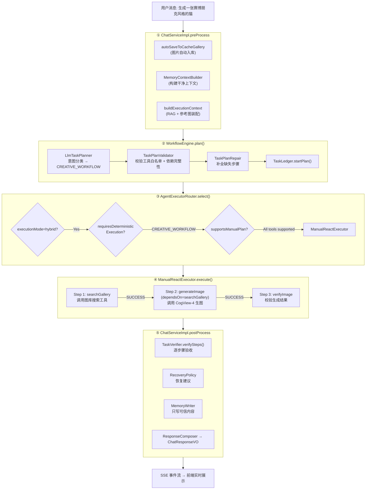

# 架构图生成提示词

为面试展示准备的结构图提示词集合。推荐使用 Excalidraw、Draw.io、或 AI 绘图工具生成。

---

## 图 1：系统架构全景图

**用途**：放在 README 最上面，30 秒抓住面试官注意力。

**推荐工具**：Excalidraw（手绘风格，GitHub 友好）或 Draw.io

### 内容结构

```
┌─ 浏览器 ───────────────────────────────────────┐
│  index.html (AI助手三栏调试台)                   │
│  gallery.html (图库管理页)                       │
└─────────────────┬──────────────────────────────┘
                  │ HTTP / SSE
                  ▼
┌─ Spring Boot :8231 ───────────────────────────┐
│  ChatController · GalleryController            │
│  Advisor链 (5个拦截器)                          │
│  WorkflowEngine (Plan→Route→Execute→Verify)    │
│  ┌──────────────┐  ┌──────────────┐           │
│  │ AutoExecutor │  │ ManualReactor│            │
│  │ (简单对话)    │  │ (多步骤工作流) │           │
│  └──────────────┘  └──────────────┘           │
└──────┬──────────────┬──────────────┬───────────┘
       │              │              │
       ▼              ▼              ▼
┌─ PostgreSQL ─┐ ┌─ Redis ─┐ ┌─ 智谱 API ──────┐
│ 元数据·向量   │ │ 会话缓存 │ │ GLM-4-Flash      │
│ pgvector     │ │ TTL 7天 │ │ GLM-4.5V (视觉)  │
│ Flyway 迁移  │ │          │ │ CogView-4 (生图) │
└──────────────┘ └─────────┘ │ Embedding-2      │
                              └──────────────────┘
```

### AI 生图提示词（English）

> Draw a clean system architecture diagram for a Java AI agent project. Show 4 horizontal layers:
>
> **Layer 1 (top) — Browser**: Two blocks labeled "index.html (AI 三栏调试台)" and "gallery.html (图库管理)". Connect down with arrow labeled "HTTP / SSE".
>
> **Layer 2 — Spring Boot Application (:8231)**: Show these components inside the application box: ChatController, GalleryController, Advisor Chain (5 interceptors), WorkflowEngine (with sub-label "Plan → Route → Execute → Verify"), and two executor boxes side by side — "AutoExecutor (简单对话)" and "ManualReactor (多步骤工作流)".
>
> **Layer 3 (bottom row, 3 boxes)**: Left — PostgreSQL box with labels "元数据 · PGVector · Flyway". Center — Redis box with label "会话缓存 · TTL 7天". Right — External API box with labels "GLM-4-Flash · GLM-4.5V (视觉) · CogView-4 (生图) · Embedding-2".
>
> Use arrows showing data flow: Browser → Controller layer → middleware and external services. Clean tech-diagram style, blue/white/gray color scheme. All labels in Chinese with English class names in parentheses where helpful.

---

## 图 2：Agent 请求处理全流程图

**用途**：面试时讲解"一个请求的完整生命周期"，展示架构设计能力。

**推荐工具**：Mermaid（代码即图表，可直接嵌入 README.md，GitHub 原生渲染）或 Draw.io

### Mermaid 代码版本



### AI 生图提示词（English）

> Draw a vertical flowchart showing the complete lifecycle of a user request in an AI Agent system. Title: "Agent 请求处理全流程". 5 main phases from top to bottom, each in a distinct color block:
>
> **Phase 1 "PreProcess" (gray)**: Auto-save uploaded image to cache gallery, build clean memory context via MemoryContextBuilder, assemble RAG + reference image context.
>
> **Phase 2 "Plan" (blue)**: LlmTaskPlanner classifies intent as CREATIVE_WORKFLOW → TaskPlanValidator checks tool whitelist and dependency integrity → TaskPlanRepair fixes missing steps → TaskLedger registers the plan. Show validator → repair feedback loop.
>
> **Phase 3 "Route" (orange)**: AgentExecutorRouter decision tree — check executionMode, check if task requires deterministic execution (CREATIVE_WORKFLOW or has dependsOn), check if all tools support manual execution, then select ManualReactExecutor.
>
> **Phase 4 "Execute" (green)**: ManualReactor runs 3 steps sequentially: searchGallery (PENDING→RUNNING→SUCCESS) → generateImage with dependsOn=searchGallery → verifyImage. Each step shows state transitions throughout.
>
> **Phase 5 "PostProcess" (purple)**: TaskVerifier checks each planned step against ledger evidence → RecoveryPolicy suggests actions for failed steps → MemoryWriter saves only trusted, verified content → ResponseComposer formats ChatResponseVO.
>
> Right sidebar: SSE event stream flowing to frontend in real-time, showing event types: chatId, task_planned, tool_call, token, task_step_completed, task_verified, done.
>
> Chinese labels with English class names in parentheses. Professional tech diagram style.

---

## 图 3：WorkflowEngine 意图路由决策树

**用途**：直接证明简历上 WorkflowEngine 的存在，展示 11 种意图分类 + 执行器路由逻辑。

**推荐工具**：Draw.io 或 PlantUML

### 内容结构

```
用户输入
    │
    ▼
┌─────────────────────────────────────────────┐
│           LLM 规划层 (兜底)                    │
│  ChatModel 输出 TaskPlanCandidate JSON        │
│  └─ 只在规则引擎无法确定时触发                  │
└─────────────────────────────────────────────┘
    │
    ▼
┌─────────────────────────────────────────────┐
│           规则引擎 (优先)                       │
│                                              │
│  包含 "生成/画一张"? ──Yes──► 有参考图?        │
│      │                        ├─ Yes → CREATIVE_WORKFLOW
│      │No                      └─ No  → IMAGE_GENERATION
│      │
│  包含 "分析/描述/看看/识别"? ──► IMAGE_ANALYSIS
│      │
│  包含 "搜索图片/Pexels/素材"? ──► WEB_IMAGE_SEARCH
│      │
│  包含 "下载/导入/保存参考"? ──► REFERENCE_COLLECTION
│      │
│  包含 "图库里/找一下图库/参考图"? ──► GALLERY_SEARCH
│      │
│  包含 "收藏/取消收藏/删除/标签"? ──► GALLERY_MANAGEMENT
│      │
│  包含 "风格模板/有哪些风格"? ──► STYLE_DISCOVERY
│      │
│  包含 "网页/搜索一下/查一下/联网"? ──► WEB_RESEARCH
│      │
│  默认 ──► CHAT
└─────────────────────────────────────────────┘
    │
    ▼
┌─────────────────────────────────────────────┐
│          AgentExecutorRouter                 │
│                                              │
│   executionMode?                             │
│   ├─ "auto"  → SpringAiAutoToolExecutor      │
│   ├─ "react" → ManualReactExecutor           │
│   └─ "hybrid" (default) → 根据 TaskType 选择  │
│         │                                    │
│         ├─ CREATIVE_WORKFLOW → Manual        │
│         ├─ hasDependsOn       → Manual        │
│         └─ others             → Auto          │
└─────────────────────────────────────────────┘
```

### AI 生图提示词（English）

> Draw a decision tree / routing diagram for a workflow engine. Title: "WorkflowEngine 意图路由决策树".
>
> **Top section**: "用户输入" as the entry point.
>
> **Middle section — Rule Engine (9 branches)**: Show 9 decision branches flowing down from the user input, each checking for Chinese keywords:
> 1. "生成/画一张" → branches to CREATIVE_WORKFLOW (with references) or IMAGE_GENERATION (without)
> 2. "分析/描述/看看" → IMAGE_ANALYSIS
> 3. "搜索图片/Pexels" → WEB_IMAGE_SEARCH
> 4. "下载/导入" → REFERENCE_COLLECTION
> 5. "图库里/参考图" → GALLERY_SEARCH
> 6. "收藏/删除/标签" → GALLERY_MANAGEMENT
> 7. "风格模板" → STYLE_DISCOVERY
> 8. "搜索/联网" → WEB_RESEARCH
> 9. Default → CHAT
>
> Add a small box labeled "LLM 规划层 (兜底)" above the rule engine, with dashed arrow showing it's only triggered when rules can't determine intent.
>
> **Bottom section — Executor Router**: Show the 3 execution modes: "auto" → SpringAiAutoToolExecutor, "react" → ManualReactExecutor, "hybrid" → decision based on TaskType: CREATIVE_WORKFLOW or hasDependsOn → Manual, others → Auto.
>
> Use a clean green/blue decision tree style. Chinese labels. Show each TaskType as a colored badge/tag.

---

## 图 4：RAG 三层检索增强数据流图

**用途**：展示 RAG 检索增强的完整链路，简历关键词的直接证据。

**推荐工具**：Excalidraw（适合展示数据流和层级关系）

### 内容结构

```
用户消息 + 图片
    │
    ├─────────────────────────────────────────────
    │              三层 RAG 链路                   │
    ├─────────────────────────────────────────────
    │
    ▼
┌─────────────────────────────────────────────────┐
│ Layer 1: 显式参考图 (最高优先级) ⭐                │
│                                                 │
│  ChatRequest.referencePictureIds [1, 5, 12]     │
│         │                                       │
│         ▼                                       │
│  ExplicitReferenceResolver                      │
│    ├─ GalleryService.getById() → 元数据          │
│    └─ PictureAiProfile → AI 视觉画像             │
│         │                                       │
│         ▼                                       │
│  输出: 结构化参考图上下文 (主题/风格/色彩/构图/光影)  │
│                                                 │
│  ⚡ 命中则短路：跳过 Layer 2 + Layer 3            │
└─────────────────────────────────────────────────┘
    │ (Layer 1 为空 → 继续)
    ▼
┌─────────────────────────────────────────────────┐
│ Layer 2: 混合检索增强 (自动触发)                   │
│                                                 │
│  ① RagQueryRewriteService                       │
│     └─ LLM 改写用户查询 (融入对话历史)             │
│         │                                       │
│         ▼                                       │
│  ② HybridGalleryRetriever                       │
│     ├─ PGVector 语义检索 (cosine, min-score=0.4) │
│     │  └─ Embedding-2 → 1024维向量 → IVFFlat     │
│     ├─ 关键词匹配 (weight: 15.0)                 │
│     └─ 元数据加权 (weight: 10.0)                  │
│         │                                       │
│         ▼                                       │
│  ③ RagReranker → 规则重排序                      │
│         │                                       │
│         ▼                                       │
│  ④ RagContextPacker                              │
│     ├─ referenceMode 裁剪 (overall/style/color)  │
│     └─ max-context-chars 截断 (2500 chars)       │
│                                                 │
│  ⚡ 有结果则短路：跳过 Layer 3                     │
└─────────────────────────────────────────────────┘
    │ (Layer 2 无结果 → 兜底)
    ▼
┌─────────────────────────────────────────────────┐
│ Layer 3: 风格模板兜底                             │
│                                                 │
│  StyleTemplateService                           │
│    └─ 关键词匹配 10 套预设模板                     │
│         ├─ 赛博朋克 · 极简 · 写实                  │
│         ├─ 插画 · 二次元 · 水彩                    │
│         └─ 水墨 · 油画 · ...                      │
│                                                 │
│  输出: 风格提示词文本                              │
└─────────────────────────────────────────────────┘
    │
    ▼
┌─────────────────────────────────────────────────┐
│  RagContext (三层上下文对象)                       │
│    ├─ explicitPictures: List<ReferencePicture>   │
│    ├─ retrievedPictures: List<RetrievedPicture>  │
│    └─ matchedTemplate: StyleTemplate?            │
└─────────────────────────────────────────────────┘
    │
    ▼
┌─────────────────────────────────────────────────┐
│  PromptReferenceAssembler                       │
│    └─ 装配最终增强 Prompt                         │
└─────────────────────────────────────────────────┘
    │
    ▼
送入 ChatClient → 模型生成
```

### AI 生图提示词（English）

> Draw a 3-layer RAG (Retrieval-Augmented Generation) pipeline diagram. Title: "三层 RAG 检索增强链路".
>
> **Layer 1 (gold/bronze highlight, top)**: "显式参考图 (最高优先级)" — User selects ≤3 images from gallery, ExplicitReferenceResolver reads gallery metadata and AI visual profile (subject, style, color, composition, lighting, mood). Output is structured reference context. Show a "⚡ 短路" arrow: when Layer 1 has data, skip directly to RagContext, bypass Layer 2 and 3.
>
> **Layer 2 (blue highlight, middle)**: "混合检索增强 (自动触发)" — 4 sub-steps in sequence: ① Query Rewrite via LLM (with conversation history context), ② Hybrid Retrieval with 3 parallel branches (PGVector semantic search cosine min-score 0.4 — keyword matching weight 15.0 — metadata weighted weight 10.0), ③ Reranker reorders results, ④ ContextPacker trims by referenceMode (overall/style/color/composition) and max chars (2500). Show another "⚡ 短路" arrow: when Layer 2 returns results, skip Layer 3.
>
> **Layer 3 (green highlight, bottom)**: "风格模板兜底" — StyleTemplateService keyword-matches across 10 preset templates (赛博朋克, 极简, 写实, 插画, 二次元, 水彩, 水墨, 油画, etc.). Output is style prompt text.
>
> **Bottom section**: "RagContext (三层上下文对象)" with 3 fields (explicitPictures, retrievedPictures, matchedTemplate) → "PromptReferenceAssembler (装配最终 Prompt)" → "ChatClient (模型生成)".
>
> Use distinct colors for each layer with clear boundaries. Show short-circuit arrows prominently. Chinese labels. Modern tech diagram style with a slight hand-drawn feel.

---

## 工具对比

| 工具 | 最适合 | 特点 |
|------|--------|------|
| **Excalidraw** (excalidraw.com) | 图 1、图 4 | 手绘风格，视觉亲和，免费，导出 PNG/SVG。适合放在 README 顶部 |
| **Mermaid** (mermaid.live) | 图 2 | 代码即图表，可直接嵌入 Markdown 在 GitHub 原生渲染。适合流程图和时序图 |
| **Draw.io** (draw.io) | 图 1、图 3 | 功能最全，精确控制布局。适合多层架构图和决策树 |
| **PlantUML** (plantuml.com) | 图 2、图 3 | 代码即图表，VS Code 插件实时预览。适合 UML 风格 |
| **Napkin.ai** | 图 1、图 4 | AI 自动生成手绘风格图表，输入文字描述即可 |

## 优先级建议

1. **图 1（架构全景）** → README 第一屏，30 秒建立信任
2. **图 2（请求流程）** → 面试时 "一个请求怎么走的" 对着这张图讲
3. **图 3（路由决策树）** → 简历写了 WorkflowEngine，这张图是最直接的证据
4. **图 4（RAG 链路）** → RAG 是简历关键词，有图比光说更可信

图 1 和图 2 优先做好。图 3 和图 4 可以先用 Mermaid 代码块直接嵌在 README 里，GitHub 原生渲染，不需要额外画图工具。
