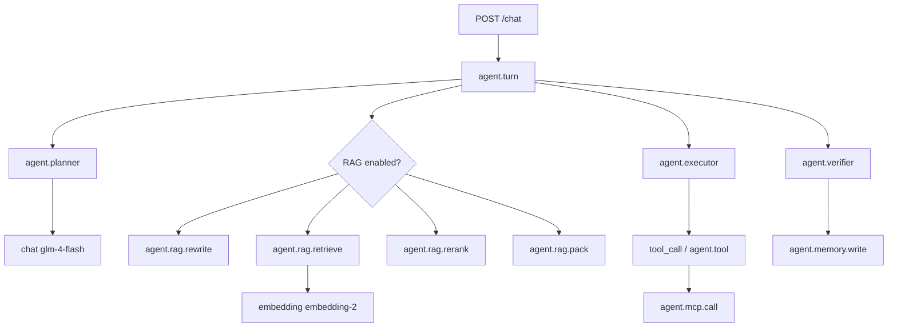

# Agent 可观测性 Trace 案例（待审核）

> 状态：本地实测完成，尚未上传 GitHub。数据时间为 2026-07-30。
>
> README 中的输入均为预先构造的公开演示数据，不代表生产 Trace 默认保存
> 用户原文。

## 1. 可观测性设计目标

Planner、RAG、Executor、Tool、Verifier 和 Memory 被拆成独立 Span，是为了
分别回答六个不同问题：

1. 模型把需求规划成了什么，后端是否校验或修复；
2. RAG 是否真实召回，选中了多少参考图；
3. 模型是否真的产生 Tool Call，后端是否真的执行工具；
4. 工具结果是否满足数量和副作用约束；
5. Verifier 是否基于工具账本而非模型文字判定；
6. 只有通过验收的结果是否进入可信记忆。

Trace 能证明代码路径、调用关系、状态、数量和耗时。它不能证明图片审美质量，
也不能把 CogView-4 的 Prompt 增强描述成像素级图生图。

### 审计结论：需要补埋点，但不需要重做架构

原项目已有 `WorkflowEngine`、结构化计划、工具账本、`TaskVerifier`、可信记忆、
RAG 分阶段 Observation、OTLP 和 Jaeger。缺口主要是：

| 审计项 | 原状态 | 本次处理 |
|---|---|---|
| 根任务隐私属性 | 不完整 | 增加长度、SHA-256、模式、独立 Demo Case ID 和 `content_captured=false` |
| Planner/Verifier/Memory | 有 Span，证据字段不足 | 补计划来源、Repair/Fallback、必选步骤、约束、证据数和写入原因 |
| RAG 参考图到生图工具 | 只靠上下文难以证明 | 后端把检索到的图库 ID 传入 `generateImage`，并补自动化测试 |
| MCP 跨进程链路 | 未验证 W3C 传播 | 先做网络 Spike；确认不传播后实现真实 Span Link |
| Pexels HTTP | 无明确服务端子 Span | 增加 `http.client.pexels` 子 Span |
| 失败重试 | 结果可见，attempt/error 证据不足 | 补有限 attempt、`mcp_timeout`、Verifier fail 和拒绝写记忆 |

Planner Prompt 没有整体重写。后端 Validator 补强了“不保存”、必选搜索步骤和
搜索后生成依赖约束；单一必选工具计划使用模型级 `tool_choice=required`，避免模型
只输出看似成功的文字却没有 Tool Call。

## 2. 总体调用链



## 3. 隐私与内容采集策略

默认不采集：

- 完整用户输入、Planner Prompt 和 Planner 原始输出；
- 完整 Executor Context、RAG Context；
- 完整工具参数、工具返回正文；
- 完整生图 Prompt、图片 URL 列表、密钥和认证头。

根 Span 只保存 `content_length`、SHA-256、模式、公开 Case ID，并明确记录：

```text
agent.request.content_captured=false
```

## 4. Trace A：雪景图库 RAG 命中后生图

### 公开演示输入

```text
参考图库中的雪景照片，帮我生成一张新的雪景照片。
保留安静、清透的冬日氛围与自然摄影质感，
画面包含覆雪树林、开阔雪地和柔和晨光，不要保存到图库。
```

请求要点：

```json
{
  "mode": "image_generation",
  "useGalleryRag": true,
  "referenceMode": "style",
  "saveGeneratedToGallery": false
}
```

### 面试中的内部流程

```text
用户需求
→ LLM Planner 生成 2 步 CREATIVE_WORKFLOW
→ Validator 发现首版计划不合法
→ Repair 得到 searchGallery -> generateImage 依赖链
→ RAG Query Rewrite
→ embedding-2 + PGVector 检索
→ 39 个候选，Rerank/Pack 选中 5 个
→ searchGallery 工具返回 5 个真实图库 ID
→ generateImage 的已验收输入携带这 5 个 ID
→ 参考图文字画像和摘要进入英文生图 Prompt
→ CogView 文生图返回真实图片
→ Verifier 验证 2/2 必选步骤、无图库写入
→ 可信记忆写入
```

### 实测结果

| 项目 | 实际值 |
|---|---:|
| Demo Case ID | `TRACE_RAG_HIT_SNOW_FINAL_20260730` |
| Trace ID | `bb3004157379ec0848fad1dc0536cb95` |
| Span 数 | 26 |
| 总耗时 | 24.1 s |
| RAG 候选 / 选中 | 39 / 5 |
| `searchGallery` 结果 | 5 |
| `generation.reference.count` | 5 |
| 生图结果数 | 1 |
| 图库 pictureId | `null` |
| Verifier | pass |
| no-save | pass |
| Memory write | true（verified） |

预期不变量全部满足：RAG 命中、参考数大于 0、生成工具成功、Verifier 通过、
无保存证据且可信记忆写入。Verifier 通过的依据是工具账本中的
`searchGallery` 与 `generateImage` 两条成功记录以及 `pictureId=null`，不是模型回复。


`agent.rag` 明细直接显示 39 个候选、选中 5 个：


`generateImage` 明细显示 5 个参考、1 个生成结果：


Verifier 明细显示 required/completed=2/2、no-save=pass：


必须如实说明：CogView-4 当前只接收文本 Prompt。参考图 ID 被纳入工具证据，
参考图画像/摘要被用于 Prompt 增强；这不是图片二进制直接输入模型的图生图。

## 5. Trace B：Pexels MCP 跨服务搜索

### 公开演示输入

```text
在 Pexels 找 3 张适合极简科技产品落地页的城市夜景素材，
只返回候选，不保存。
```

### 面试中的内部流程

```text
用户需求
→ Planner 产出 WEB_IMAGE_SEARCH
→ Validator 保证 pexelsSearchPhotos 是 required、没有重复同名步骤且没有保存步骤
→ Repair 在模型偶发生成重复搜索步骤时去重，保持单工具自动执行路径
→ 模型级 tool_choice=required
→ glm-4-flash 产生 pexelsSearchPhotos Tool Call
→ Spring AI Tool Callback 执行 PexelsSearchTools
→ McpToolInvoker 发起真实 SSE tools/call
→ MCP Server 调用真实 Pexels HTTP API
→ 返回 3 个候选
→ Verifier 检查 result_count=pass、no_save=pass
→ 可信记忆写入
```

### W3C 传播 Spike 与如实降级

Spring AI 1.0.0 / MCP SDK 0.10.0 的 SSE Transport 不会在每次消息 POST
中注入当前 `traceparent`。网络 Spike 的结果为：

```text
活动父 Span                     2
对照载体合法 traceparent        2
实际 MCP POST traceparent       0
实际 MCP POST tracestate        0
```

因此没有伪造“同一 traceId 父子链”，实际关系是：

```text
Main Trace d546c32b...
└─ agent.mcp.call span 2b66e417...
                     \
                      \ Span Link / Jaeger FOLLOWS_FROM
                       \
MCP Trace bfaf143e...
└─ mcp.server.tools/call
   └─ http.client.pexels
```

### 实测结果

| 项目 | 实际值 |
|---|---|
| Demo Case ID | `TRACE_MCP_PEXELS_FINAL_20260730` |
| 主 Trace ID | `d546c32bf703efc1bd6bc640d5b52347` |
| MCP Server Trace ID | `bfaf143e89c4586f83a72f67cc627200` |
| MCP Client Span ID | `2b66e4179c39ab6c` |
| 主 Trace 总耗时 | 34.760 s |
| Planner | 13.939 s |
| Executor | 20.175 s |
| MCP Client | 851.5 ms |
| MCP Server | 770.2 ms |
| Pexels HTTP | 761.4 ms |
| 最慢业务子 Span | 最终 `chat glm-4-flash`，15.545 s |
| result count | 3 |
| W3C transport propagation | false |
| Span Link created | true |
| Verifier | pass |
| result-count / no-save | pass / pass |
| Memory write | true（verified） |

模型只负责产生 Tool Call；Spring AI Tool Callback、MCP Client、MCP Server 和
Pexels HTTP 都有真实执行证据。Validator 禁止不保存请求出现导入/保存步骤，
Verifier 再以本轮工具账本验证 result count 与 no-save。

34.8 秒并非 MCP 或 Pexels 慢：Pexels HTTP 只占 761 ms。主要耗时来自
Planner 模型 13.868 秒、工具前模型 3.723 秒，以及拿到工具结果后的最终模型
15.545 秒。这里保留完整披露，避免把端到端耗时误归因于远程 MCP。


## 6. Trace C：MCP 超时、有限重试、验收失败

### 故障注入

使用本地受控延迟 Pexels 端点：每次请求延迟 10 秒；MCP Client 请求超时为
2 秒（实际框架配置仍表现为约 2 秒 Span）；Resilience4j 最大尝试次数为 2。
不依赖真实 Pexels 偶发故障。

### 公开演示输入

```text
在 Pexels 找 3 张城市夜景图片，只返回候选，不保存。
```

### 内部流程

```text
Planner 首版计划校验失败
→ Repair 仍不合法
→ Rule fallback 得到 1 个 required 搜索步骤
→ 模型产生 1 个 pexelsSearchPhotos Tool Call
→ MCP attempt 1 超时
→ MCP attempt 2 超时
→ 停止重试
→ 工具账本记录失败
→ Verifier required=1、completed=0、verdict=fail
→ Recovery 返回安全失败说明，不编造 URL
→ Memory write=false
```

### 实测结果

| 项目 | 实际值 |
|---|---|
| Demo Case ID | `TRACE_MCP_TIMEOUT_FINAL_20260730` |
| Trace ID | `c75a5502548466ad42fce863aba358e1` |
| Span 数 | 20 |
| 总耗时 | 29.5 s |
| Tool Call 数 | 1 |
| MCP attempts | 1、2 |
| Planner | 14.955 s |
| Executor | 13.915 s |
| 工具前模型 | 4.423 s |
| MCP Tool Callback | 4.379 s |
| MCP attempt 1 / 2 | 2.022 s / 2.017 s |
| 工具后模型 | 5.075 s |
| 最慢业务子 Span | Planner 的 `chat glm-4-flash`，14.887 s |
| error.type | `mcp_timeout` |
| task outcome | failed |
| Verifier | fail |
| required / completed | 1 / 0 |
| Memory write | false（verification_failed） |
| 返回候选 URL | 0 |

这条 Trace 的关键不变量是“失败不可伪装成成功”：两次超时后停止，必选步骤没有
成功证据，Verifier 判定失败，Recovery 不返回候选 URL，可信记忆写入为 false。

29.5 秒不是“2 秒超时配置失效”。端到端耗时还包含 14.955 秒规划、
4.423 秒工具前模型调用、两次 2 秒 MCP 尝试及有限重试间隔、5.075 秒工具后
模型调用。单次 MCP Span 均在约 2.02 秒结束。


## 7. 无工具快速路径与流式性能基线

公开输入：

```text
请用一句话说明这个图片 Agent 的核心能力。
```

2026-07-31 本机实测：

| 项目 | 实际值 |
|---|---:|
| Demo Case ID | `TRACE_STREAM_CHAT_BASELINE_20260730` |
| Trace ID | `c5c834ed7e5f279f74cdcf2865f2cfe6` |
| Span 数 | 16 |
| Agent Turn 总耗时 | 3.102 s |
| 模型首 Chunk（服务端） | 1.939 s |
| 首个 SSE Token 发出（服务端） | 1.981 s |
| 首个 SSE Token 到达脚本（客户端观测） | 2.114 s |
| 客户端总耗时 | 3.148 s |
| Verifier / Memory | pass / true |

`gen_ai.response.time_to_first_chunk_ms` 是模型流首 Chunk；
`agent.http.time_to_first_sse_token_ms` 是服务端首次发出 token 事件；演示脚本中的
`firstVisibleTokenMs` 才是客户端实际收到首 token 的时间。三者不混称为 TTFT。
脚本不打印 token 正文。

## 8. Span 属性字典（核心字段）

| 属性 | Span | 含义 | 敏感性 |
|---|---|---|---|
| `agent.demo.case_id` | `agent.turn` | 独立请求头中的公开案例 ID | 否 |
| `agent.request.content_hash` | `agent.turn` | 输入 SHA-256，不含原文 | 低 |
| `agent.plan.source` | Planner | LLM、Repair 或规则兜底来源 | 否 |
| `agent.rag.candidate_count` | RAG | 检索候选数 | 否 |
| `agent.generation.reference.count` | Tool | 进入生成工具的参考 ID 数 | 否 |
| `agent.tool.result_count` | Tool | 经解析的结果数 | 否 |
| `agent.mcp.trace_context_propagated` | MCP | SSE 是否真实传播 W3C Context | 否 |
| `agent.verify.verdict` | Verifier | 证据验收结果 | 否 |
| `agent.verify.constraint.no_save` | Verifier | 不保存约束 | 否 |
| `agent.memory.write` | Memory | 是否写入可信记忆 | 否 |
| `error.type` | 失败 Span | 脱敏错误分类，如 `mcp_timeout` | 低 |

`chatId`、`turnId` 和 `toolCallId` 仅作为 Trace 高基数属性用于排查，不作为
Prometheus 标签，也不承担跨 Trace 父子关系。

## 9. 当前限制

- Spring AI 1.0.0 + MCP SDK 0.10.0 SSE 不能可靠逐调用传播 W3C
  Trace Context，当前使用 Span Link。
- Jaeger 会显示两个 Trace，不能描述成同一 traceId 的端到端父子链。
- 后续可选：升级 Spring AI/MCP SDK、验证 Streamable HTTP，或实现逐请求
  W3C Header 注入的自定义 Transport。
- CogView-4 是文生图；当前 RAG 是图片画像和检索结果驱动的 Prompt 增强。
- 运行时不采集完整英文生图 Prompt，因此不能从 Jaeger 还原正文；这是数据最小化，
  不是 Trace 丢失。
- 本机耗时不代表生产性能；RAG Trace 能证明链路与引用传递，不能单独证明审美提升，
  生成质量仍需要离线评测。
- Jaeger 使用本地内存存储，进程重启后上述 Trace ID 会失效；截图和表格是
  本次真实运行的固定证据。

## 10. 复现

```powershell
$env:AGENT_BASE_URL = "http://localhost:8231/api"
powershell.exe -NoProfile -ExecutionPolicy Bypass -File .\scripts\trace-demo\run-rag-hit-image.ps1
powershell.exe -NoProfile -ExecutionPolicy Bypass -File .\scripts\trace-demo\run-mcp-pexels-search.ps1
powershell.exe -NoProfile -ExecutionPolicy Bypass -File .\scripts\trace-demo\run-failure-or-fallback.ps1
powershell.exe -NoProfile -ExecutionPolicy Bypass -File .\scripts\trace-demo\run-stream-chat.ps1
```

前三个核心脚本不是单纯 HTTP 冒烟。请求完成后会通过 Jaeger API 按
`agent.demo.case_id` 找到本轮 Trace，并自动断言：

- Trace A：RAG 候选/选中数、生成参考数、工具成功、no-save、Verifier、Memory；
- Trace B：3 个候选、MCP Client 成功、真实 Span Link、MCP Server 与
  `http.client.pexels`、no-save、Verifier、Memory；
- Trace C：恰好 2 次 attempt、`mcp_timeout`、Verifier fail、任务失败和
  `memory.write=false/verification_failed`。

任何属性缺失或不符合预期，脚本都会以非 0 状态退出。脚本只输出数量、状态、
Trace ID 和耗时，不打印完整工具结果或图片 URL。

完整 MCP Spike 结论见：

```text
.ai/handoffs/2026-07-30-mcp-sse-trace-context-spike.md
```

## 11. 本地验证结果

| 命令 | 结果 |
|---|---|
| 主应用 `mvn test` | 267 tests，0 failure，0 error，3 skipped（264 passed） |
| MCP Server `mvn test` | 24 tests，全部通过 |
| 主应用与 MCP Server `mvn -DskipTests verify` | 均通过 |
| GitHub Actions 配置 | 分别运行根项目与独立 MCP Server 测试 |
| `git diff --check` | 通过 |
| 4 个 PowerShell 入口脚本及 Jaeger 断言辅助脚本语法检查 | 通过 |
| 三条历史实测 Trace 的 Jaeger 自动断言 | 全部通过 |

合计 288 个测试通过。跳过项是仓库原有的显式外部模型测试，不计为通过。
