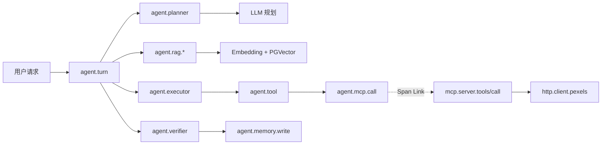
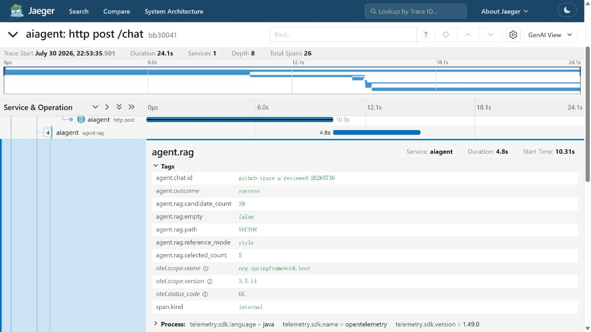
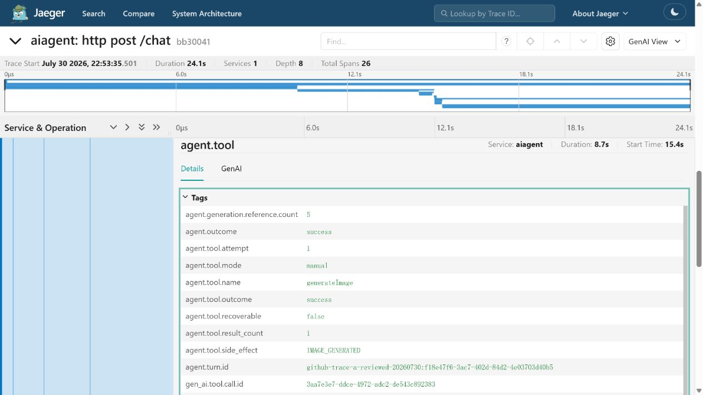
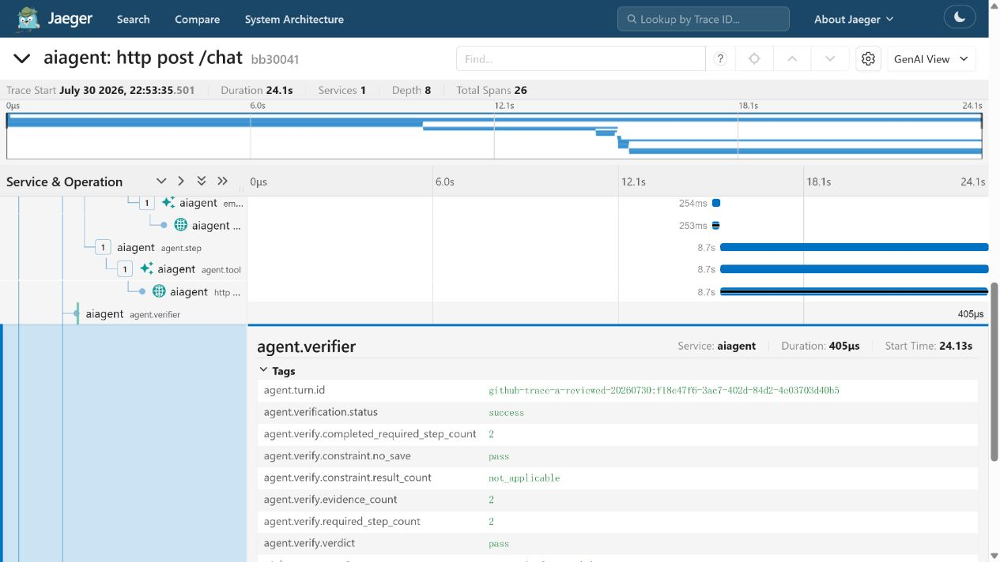
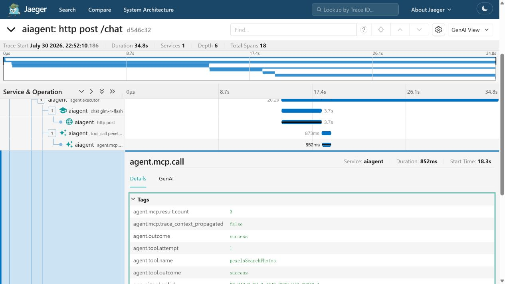
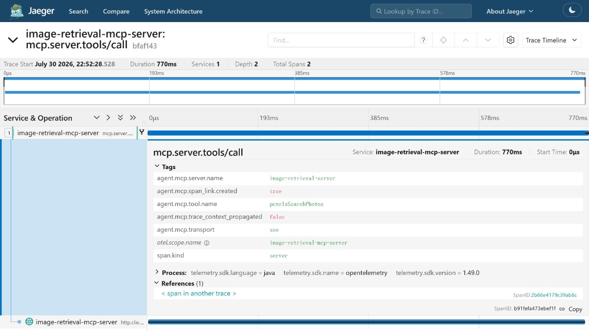
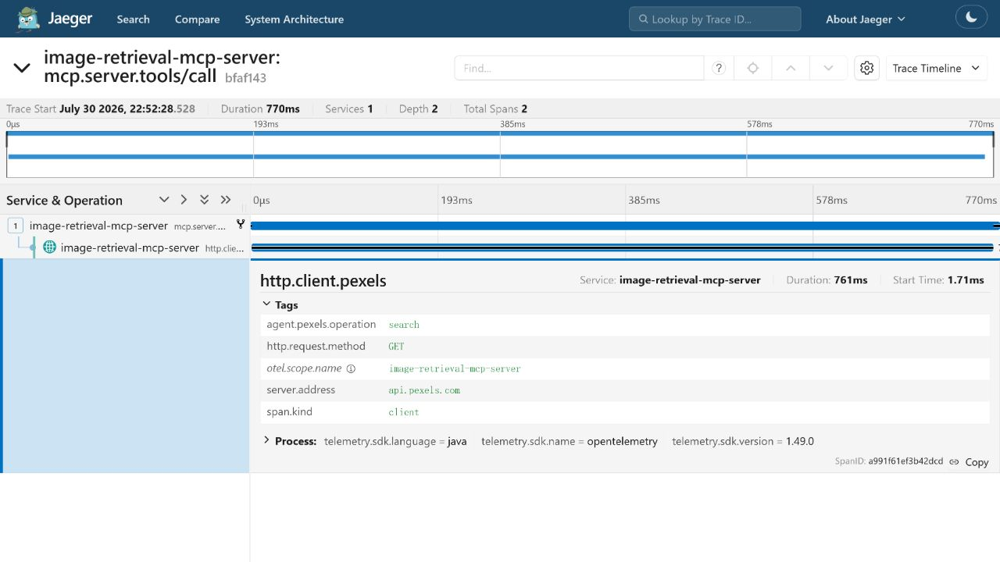
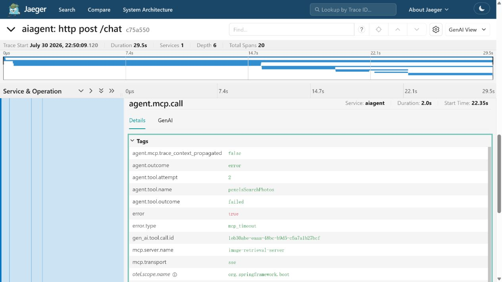
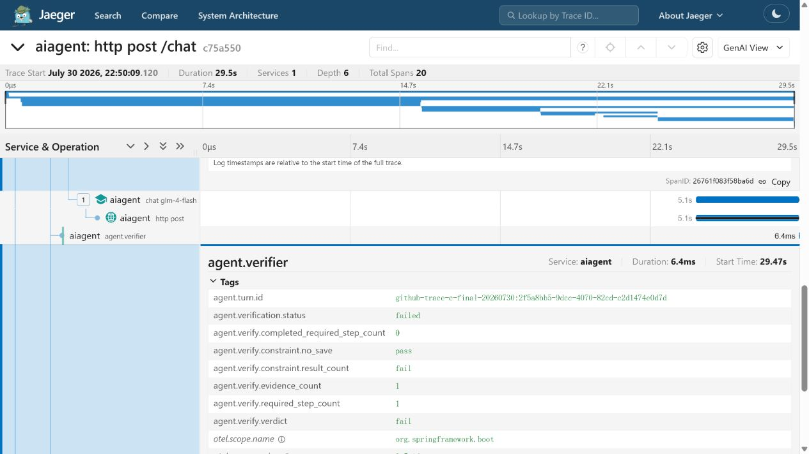
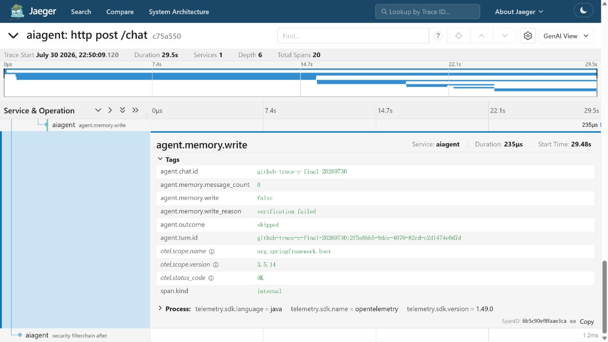

# Agent 可观测性：从用户意图到可信结果

可观测性建立目标：
- 模型如何理解用户需求，生成的计划是否经过后端校验与修复；
- RAG 是否真实命中图库，检索结果是否进入后续生成步骤；
- Tool Call 是否真正执行，远程 MCP 服务是否调用了外部 API；
- 结果是否满足数量、依赖关系和“不保存”等业务约束；
- 失败后进行了几次重试，为什么停止，以及失败内容是否被隔离在可信记忆之外。

本文展示四条来自本地真实运行的 Trace。其中三条覆盖完整业务链路，
流式快速路径作为性能基线。所有输入都是专门构造的公开展示数据，
Trace 默认不采集用户原文、完整 Prompt、工具返回正文或图片 URL。

## 可观测性架构



系统采用“模型负责理解和生成，后端负责执行、记账和校验”的边界：

1. `LlmTaskPlanner` 将自然语言需求转换为结构化计划；
2. Validator、Repair 和规则兜底保证计划满足依赖与副作用约束；
3. Hybrid Executor 根据任务类型选择 Spring AI Tool Calling 或后端顺序执行；
4. Tool Ledger 保存本轮真实工具证据；
5. `TaskVerifier` 基于计划和工具账本判定结果，不采信模型的成功声明；
6. 只有通过校验的内容才能写入可信记忆。

## 代表性 Trace

| Trace | 场景 | 展示的系统能力 | 结果 |
|---|---|---|---|
| A | 图库 RAG 雪景生图 | 检索结果进入生成步骤，副作用约束被校验 | 39 个候选 → 5 个参考 → 1 张图片 |
| B | Pexels MCP 搜索 | Tool Calling、跨进程追踪、外部 HTTP 调用 | 返回 3 个真实候选，使用 Span Link 关联 |
| C | MCP 超时 | 有限重试、失败校验、可信记忆隔离 | 2 次超时 → Verifier fail → Memory=false |
| D | 流式聊天 | 模型首块、服务端首事件和客户端首 Token 分层计时 | 客户端首 Token 2.114 s |

---

## Trace A：图库 RAG 命中后生成雪景

### 用户需求

```text
参考图库中的雪景照片，帮我生成一张新的雪景照片。
保留安静、清透的冬日氛围与自然摄影质感，
画面包含覆雪树林、开阔雪地和柔和晨光，不要保存到图库。
```

请求启用 `image_generation`、图库 RAG 和 `style` 参考模式，
同时设置 `saveGeneratedToGallery=false`。

### 系统如何处理

```text
用户需求
  → Planner 生成 CREATIVE_WORKFLOW
  → Validator 检查步骤与“不保存”约束
  → Repair 形成 searchGallery → generateImage 依赖链
  → Query Rewrite 提取雪景、自然摄影、晨光等检索语义
  → Embedding + PGVector 召回 39 个候选
  → Rerank 与 Context Pack 选出 5 个参考
  → searchGallery 返回 5 个真实图库 ID
  → generateImage 接收这 5 个 ID 对应的图片画像与摘要
  → CogView 生成 1 张图片
  → Verifier 确认 2/2 必选步骤完成，且没有图库写入
  → 可信结果写入会话记忆
```

### Trace 数据

| 指标 | 实测值 |
|---|---:|
| Trace ID | `bb3004157379ec0848fad1dc0536cb95` |
| Span 数 | 26 |
| 端到端耗时 | 24.1 s |
| RAG 候选数 | 39 |
| RAG 选中数 | 5 |
| 进入生成工具的参考数 | 5 |
| 生成结果数 | 1 |
| 图库写入 | 否，`pictureId=null` |
| Verifier | pass |
| Memory write | true，原因 `verified` |

Trace 树同时呈现 Planner、RAG、Executor、Tool、Verifier 和 Memory，
能够从一次请求中还原完整的 Agent 决策链。


`agent.rag` Span 显示 39 个候选经过重排与压缩后选中 5 个参考：



生成工具记录 `agent.generation.reference.count=5`，
证明参考内容进入了生成步骤，而不只是出现在检索日志中：



Verifier 根据工具账本确认 `required/completed=2/2`，
并确认“不保存到图库”的约束成立：



最终生成结果：


> 当前 CogView-4 接口是文生图。图库图片先经过画像分析和语义检索，
> 再以结构化文字上下文增强生成 Prompt；这属于 RAG Prompt 增强，
> 不是像素级图片输入的图生图。

---

## Trace B：跨进程 MCP 图片搜索

### 用户需求

```text
在 Pexels 找 3 张适合极简科技产品落地页的城市夜景素材，
只返回候选，不保存。
```

### 系统如何处理

```text
用户需求
  → Planner 识别为 WEB_IMAGE_SEARCH
  → Validator 保证 pexelsSearchPhotos 是必选步骤且不存在保存步骤
  → 模型在 tool_choice=required 约束下产生 Tool Call
  → Spring AI Tool Callback 调用 MCP Client
  → MCP Server 执行 Pexels 搜索工具
  → Pexels HTTP API 返回 3 个候选
  → Verifier 校验结果数量和“不保存”约束
  → 可信结果写入会话记忆
```

### 跨进程追踪关系

Spring AI 1.0.0 / MCP SDK 0.10.0 的 SSE Transport
没有在每次 MCP 消息 POST 中传播当前 W3C `traceparent`。
因此主应用和 MCP Server 使用两个真实 Trace，并通过 OpenTelemetry Span Link
表达因果关系：

```text
Main Trace d546c32b...
└── agent.mcp.call 2b66e417...
                    \
                     \ Span Link
                      \
MCP Trace bfaf143e...
└── mcp.server.tools/call
    └── http.client.pexels
```

该关系明确记录：

```text
agent.mcp.trace_context_propagated=false
agent.mcp.span_link.created=true
```

`toolCallId`、`turnId` 等业务字段只用于检索和关联，
不会被描述成同一 Trace 的父子关系。

### Trace 数据

| 指标 | 实测值 |
|---|---:|
| 主 Trace ID | `d546c32bf703efc1bd6bc640d5b52347` |
| MCP Server Trace ID | `bfaf143e89c4586f83a72f67cc627200` |
| 端到端耗时 | 34.760 s |
| Planner | 13.939 s |
| Executor | 20.175 s |
| MCP Client | 851.5 ms |
| MCP Server | 770.2 ms |
| Pexels HTTP | 761.4 ms |
| 返回候选数 | 3 |
| Span Link | created |
| Verifier | pass |
| Memory write | true，原因 `verified` |

端到端耗时主要来自模型：Planner 模型调用为 13.868 秒，
工具返回后的最终模型调用为 15.545 秒；Pexels HTTP 仅占 761.4 毫秒。
分层 Span 避免把整体延迟错误归因于 MCP 或外部图片服务。

主应用 MCP Client Span：



MCP Server Trace 中的 Span Link：



Pexels HTTP 是 MCP Server Span 的真实子节点：



---

## Trace C：超时、有限重试与失败隔离

### 故障场景

请求仍然要求从 Pexels 返回 3 张城市夜景图片，但外部端点被替换为本地受控延迟服务。
服务每次延迟 10 秒，MCP Client 单次超时约 2 秒，
Resilience4j 最多尝试 2 次。

### 系统如何处理

```text
Planner 与 Repair 未生成合法计划
  → Rule fallback 生成 1 个必选搜索步骤
  → 模型产生 pexelsSearchPhotos Tool Call
  → MCP attempt 1 超时
  → MCP attempt 2 超时
  → 达到重试上限，工具账本记录失败
  → Verifier 判定 required=1、completed=0、verdict=fail
  → Recovery 返回安全失败说明，不生成候选 URL
  → Memory write=false
```

### Trace 数据

| 指标 | 实测值 |
|---|---:|
| Trace ID | `c75a5502548466ad42fce863aba358e1` |
| Span 数 | 20 |
| 端到端耗时 | 29.5 s |
| Planner | 14.955 s |
| Executor | 13.915 s |
| MCP attempt 1 | 2.022 s |
| MCP attempt 2 | 2.017 s |
| `error.type` | `mcp_timeout` |
| 必选步骤 / 完成步骤 | 1 / 0 |
| Verifier | fail |
| Memory write | false，原因 `verification_failed` |
| 返回候选 URL | 0 |

29.5 秒包含规划、工具前模型调用、两次 MCP 尝试、
重试间隔和工具后模型调用。两个 MCP attempt 均在约 2.02 秒结束，
说明单次超时配置正常生效。

完整 Agent Trace 与两次失败尝试：


第二次 MCP 调用记录了明确的超时分类：



Verifier 不接受缺少工具证据的模型回复：



失败结果不会污染可信记忆：



---

## 流式快速路径

无工具聊天用于区分模型生成速度、服务端事件发送速度和客户端可见速度。

| 指标 | 实测值 |
|---|---:|
| Trace ID | `c5c834ed7e5f279f74cdcf2865f2cfe6` |
| Agent Turn | 3.102 s |
| 模型首个 Chunk | 1.939 s |
| 服务端首个 SSE Token | 1.981 s |
| 客户端首个可见 Token | 2.114 s |
| 客户端总耗时 | 3.148 s |
| Verifier / Memory | pass / true |

项目分别使用以下指标，避免把不同观测位置都笼统称为 TTFT：

- `gen_ai.response.time_to_first_chunk_ms`：模型流的首个 Chunk；
- `agent.http.time_to_first_sse_token_ms`：服务端首次发送 Token 事件；
- `firstVisibleTokenMs`：客户端真正收到首个 Token。

## Trace 数据边界

可公开观测的字段：

| 属性 | 作用 |
|---|---|
| `agent.demo.case_id` | 定位公开展示请求 |
| `agent.request.content_hash` | 使用 SHA-256 区分输入，不保存原文 |
| `agent.plan.source` | 标识计划来自 LLM、Repair 或规则兜底 |
| `agent.rag.candidate_count` | RAG 初始候选数 |
| `agent.rag.selected_count` | 重排后参考数 |
| `agent.generation.reference.count` | 进入生成步骤的参考数 |
| `agent.tool.result_count` | 结构化工具结果数 |
| `agent.mcp.trace_context_propagated` | MCP Transport 是否传播 W3C Context |
| `agent.verify.verdict` | 后端校验结论 |
| `agent.verify.constraint.no_save` | “不保存”约束是否满足 |
| `agent.memory.write` | 是否写入可信记忆 |
| `error.type` | 脱敏错误分类 |

默认不进入 Trace 的内容：

- 用户输入原文、Planner Prompt 和模型原始输出；
- 完整 RAG Context、生成 Prompt 和 Executor Context；
- 工具参数、工具返回正文和图片 URL；
- API Key、认证头和环境变量值。

根 Span 明确记录 `agent.request.content_captured=false`。
高基数字段只用于 Trace 内排查，不作为 Prometheus 标签。

## 可验证资产

仓库中的 [`scripts/trace-demo`](../../scripts/trace-demo/)
提供四个公开场景入口，并通过 Jaeger API 自动检查关键 Span 属性。
这些检查覆盖 RAG 候选与参考数量、MCP Span Link、Pexels HTTP 子 Span、
有限重试、Verifier 结论和 Memory 写入状态。

工程测试同时覆盖主应用和独立 MCP Server：

| 模块 | 测试结果 |
|---|---:|
| 主应用 | 264 passed，3 skipped |
| MCP Server | 24 passed |
| 合计 | 288 passed |

## 当前能力边界

- Spring AI 1.0.0 + MCP SDK 0.10.0 的 SSE Transport
  不能可靠地逐调用传播 W3C Trace Context，当前使用 Span Link 表达跨 Trace 因果关系。
- 后续可以评估升级 Spring AI/MCP SDK、改用支持上下文传播的传输方式，
  或实现自定义 W3C Header 注入。
- CogView-4 当前是文生图接口，图库 RAG 提供的是图片画像驱动的 Prompt 增强，
  不等同于原图像素输入的图生图。
- Trace 可以证明调用关系、参数数量、状态和耗时，
  但生成图片的审美质量仍需要独立的离线评测。
- 当前展示环境使用 Jaeger 内存存储，因此文档中的截图和指标作为固定运行证据保留。
